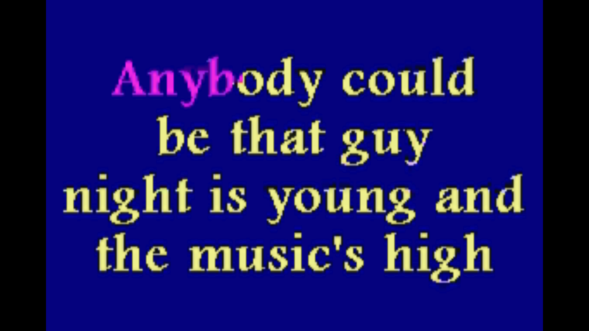
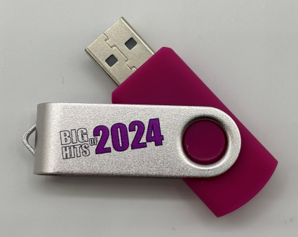
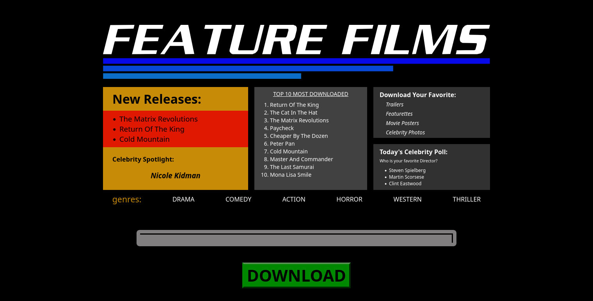
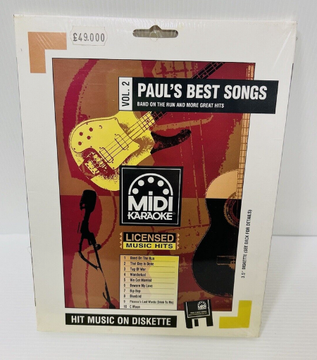
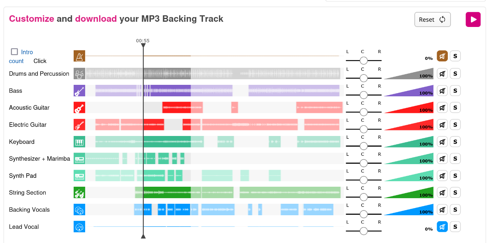
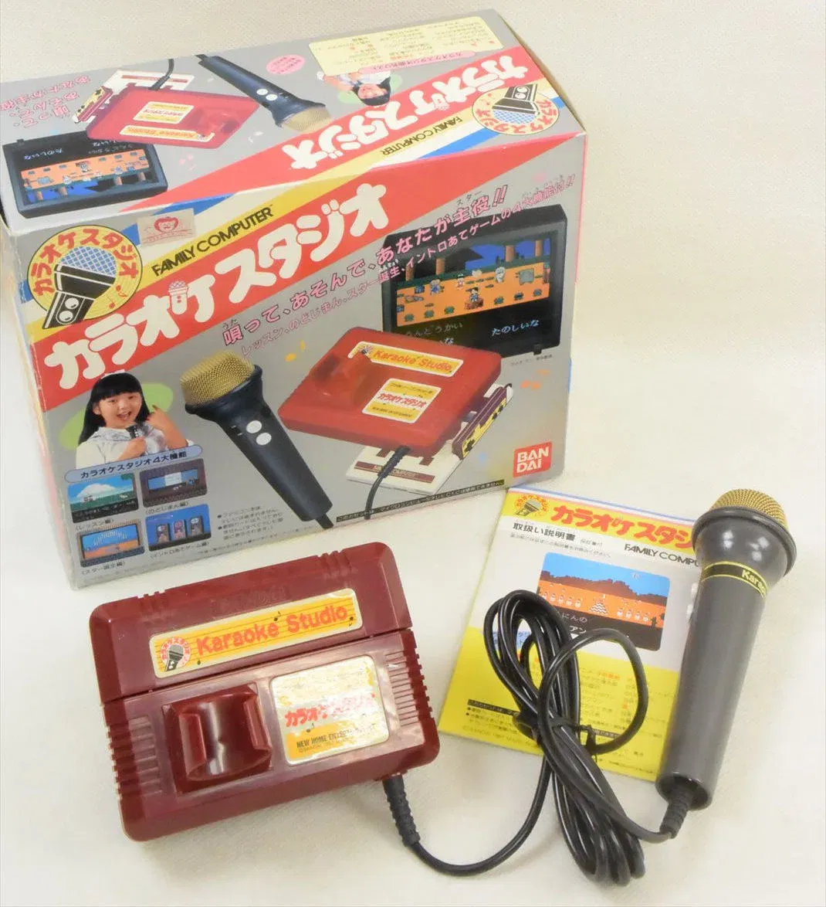
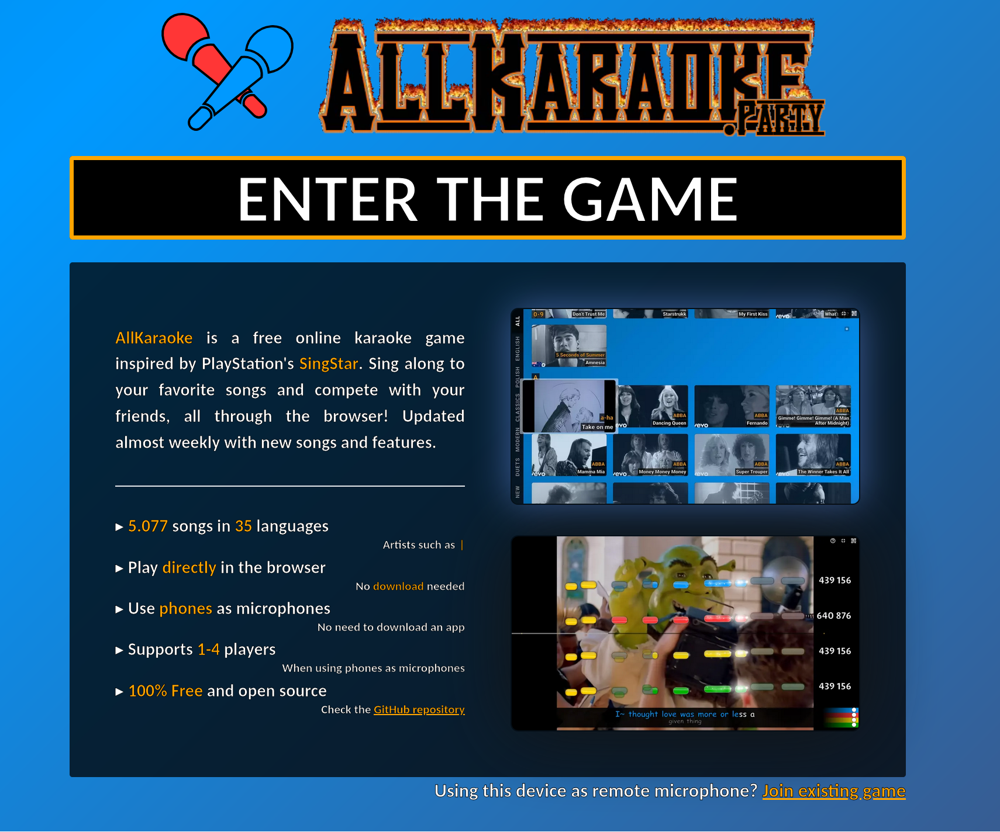
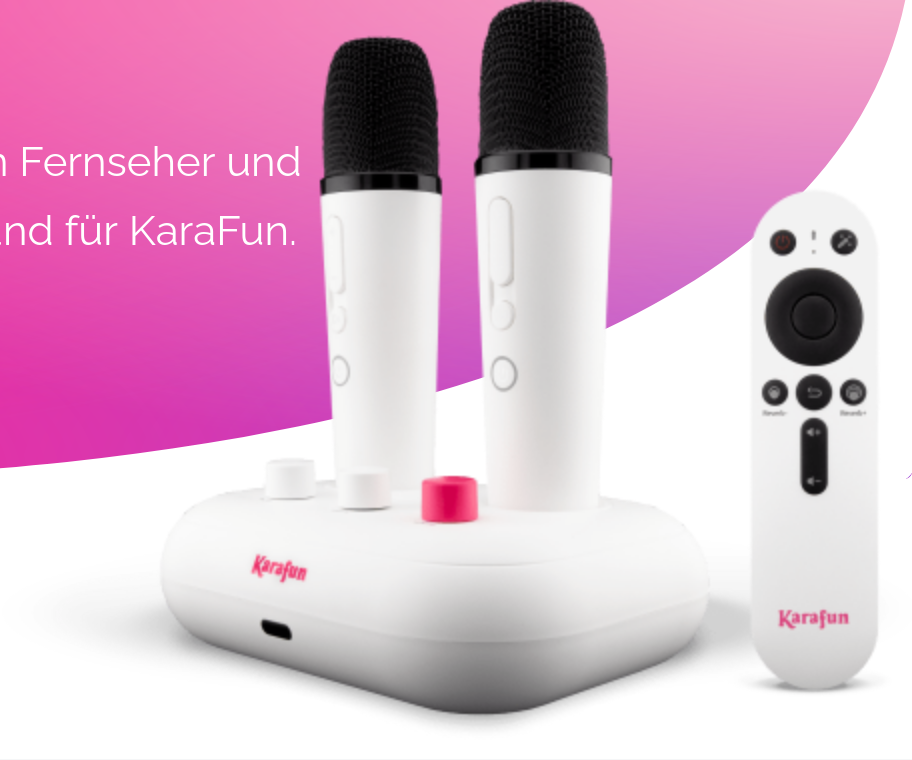
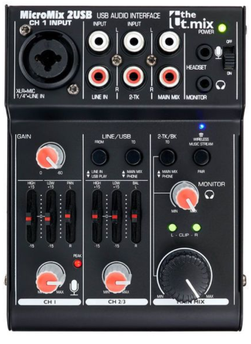

<!-- class: lead -->
# Wie Karaoke funktioniert

MRMCD 2025

nachtpfoetchen

---
<!-- class: default -->
# me
- played way too much karaoke while i should make slides
- enby das irgendwie gerne Karaoke Dinge tut
- Pronomen??? existieren vielleicht, idk, halp
- fedi? nachtpfoetchen@donotsta.re
# ow
Slides: https://github.com/Nachtpfoetchen/2025-MRMCD-Karaoke
Markdown für Marp

---
<!-- class: lead -->
# Was ist Karaoke?

---
<!-- class: default -->

Dancing Queen mp3+cdg

## Grundsätzlich
- Musik
- getimter Text?
- Viel Spaß

---
<!-- class: default -->

Singstar

## Optional
- Videos
- Animation
- Tonhöhe
- Mikrofon
- Backing Vocals
- Songlisten-Management

---
# Größten technischen Änderungen

- Dateigröße
- Variable Tonhöhe
- Variables Tempo
- Spiele mit Punkten
- Spiele mit Lipsync
- Kataloggröße
- Automatische Entfernung der Backing Vocals

---
<!-- class: default -->

 # Karaoke Maschinen

- Maschienen zum Karaoke spielen
- Bildschirm
- Mikrophon
- Karaoke Booth
  

---
<!-- class: default -->

# VHS, Laserdisc

Laserdisk Karaoke Setup von Claudiu Dobondi youtube

- Video mit getimten Lyrics
- Verwendung von Videomaterial im Hintergrund
- Player, Bildschirm, Mikrofon

---

# CD+Graphics

- Visualisierung im Subcode der CD
- Limitierung auf Bitmaps
- Hintergrund idr Einfarbig
- Viele Lieder auf einer Disc
- Bis heute kommerzieller Vertrieb

---

Mr. Entertainer CD+G Release

Zoom Karaoke USB Release

---

---

# mp2/3/ogg/etc + cgd

- Umsetzung des Subcodes der CD+G als eigene binär Datei die parallel zum Playback abgespielt wird.
- Durch emule, p2p filesharing erstmals umfassende Kataloge
- Bis heute Kommerzieller Vertrieb

---

# Midi Karaoke

- Lied wird in MIDI nach programmiert
- getimte Lyrics werden zum midi hinzugefügt
- kleine Dateigröße

---

Karaoke version: Medley ABBA - Medley Covers - Custom Backing Track MP3

---

# Spielekonsolen (Auswahl)

| Jahr | Konsole | Markt | Erweiterung | 
| --- | --- | --- | --- |
| 1987 | Famicon | Japan | Karaoke Studio |  
| 1992 | Sega Mega-CD | Japan | Sega Mega-CD Karaoke |
| 2004 | PS2 | Europe, Oceania | SingStar |
| 2014 | C64 | Worldwide |  International Karaoke+ |

---

Dreamcast Karaoke Erweiterung
[https://www.k-yen-team.fr/karaoke-sur-sega-dreamcast/]

famicon Erweiterung

---

C64 International Karaoke+

---
 
 # Singstar

 - Release 2004
 - Weiterentwicklung des Spielprinzips durch Score
 - Große Verbreitung in Europa
 - teilweise Exklusive Videos
 - teilweise orginale Songs

---

# Ultrastar

Gameplay usdx 0.8.2

- Nachbau der Mechaniken von Singstar
- Große Community, Tooling, Torrents. etc. für Songs
- Offenes Format zur Erstellung von Songs

---

# Projekte um Ultrastar

| Jahr | Open Source|  Projektname |
| --- | --- | --- |
| 2004 | ja (ursprünglich) | Ultrastar |
| 2007 | ja | Performous |
| 2007 | ja | Ultrastar Deluxe | 
| 2009 | ja | Yass Karaoke Editor |
| 2011 | ja | Fork Ultrastar World Party |
| 2020 | ja | Ultra Star Play |
| 2023 | nein | Melody Mania |

---
<!-- class: lead -->

---
<!-- class: default -->

# Cloud

- Karafun
- Spotify
- Apple Music
- youtube
- smule
- Starmaker

---

# Just Sing

- 2016 PS4 XBox 1
- Weiterentwicklung des Spielprinzips durch Lipsync über einen Smartphone Companion / Kinect / Playstation Camera

# Let's Sing

 - Ähnliches Spielprinzip wie Singstar, just sing
 - Erster Release 2012 auf Wii

---

# Karaoke Mugen

---

# Karaoke Player linux

- mp3+cdg support in ffmpeg
- Spivak
- Ultrastar*
- Webbrowser (All Karaoke party, youtube, karafun, etc)
- Konsolenemulation
- Karaoke Mugen

---

# Karaoke Suchmaschienen

- https://www.karaokenerds.com/
- http://www.icroons.com/
- https://karatrack.com
- https://db.openkj.org/

---

# Hardware

- Mikrofon bei Bedarf
- Mixer
- Spzielle Karaoke Hardware / Software kann ggf Tonhöhe und Tempo variieren
- Bildschirm
- Boxen

---

# Bild-Quellen

später auf github